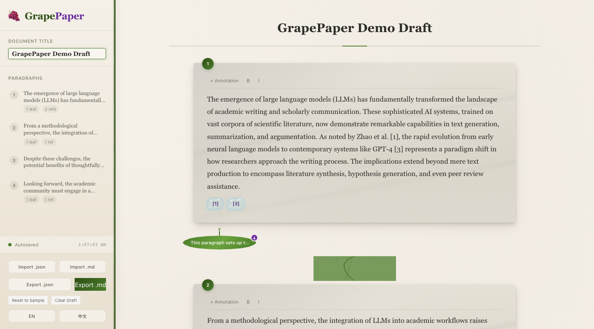
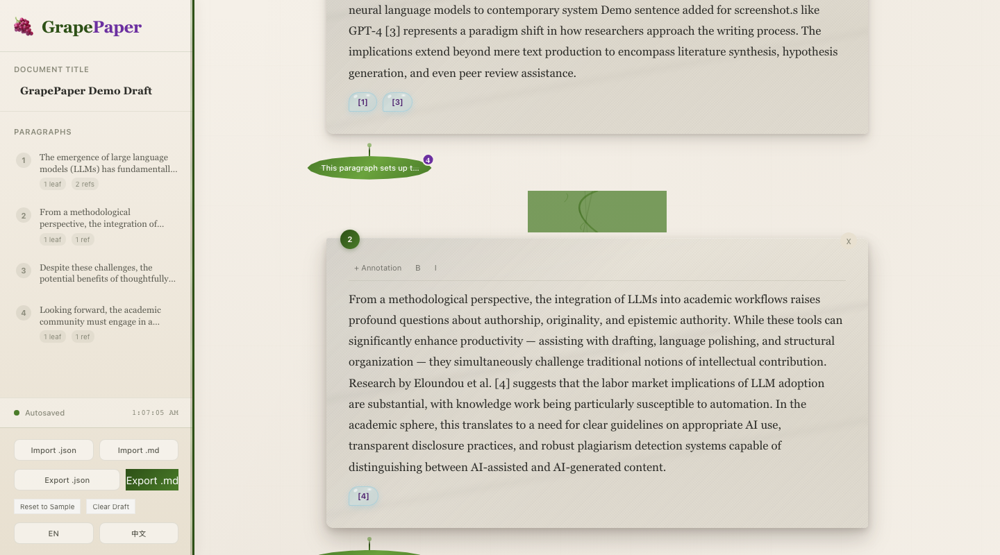
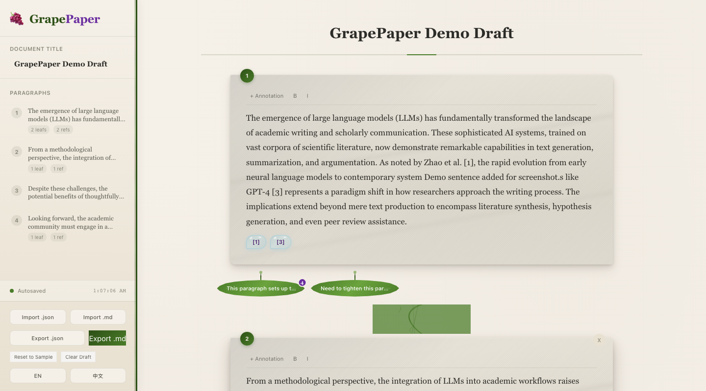
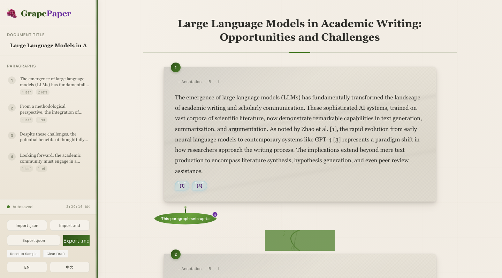
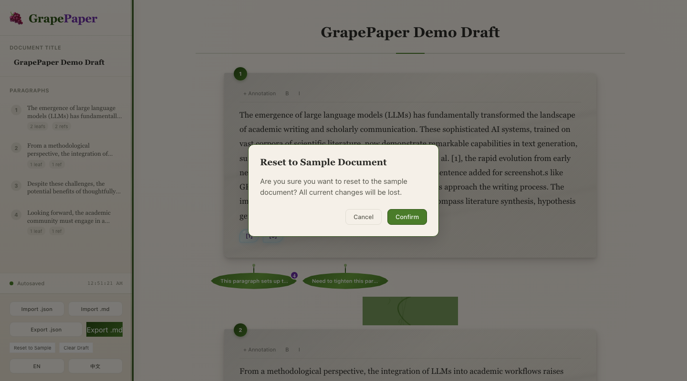

# GrapePaper 🍇 - 自然隐喻驱动的学术写作工具

## 摘要
GrapePaper 是一个以葡萄藤为主题的学术论文编辑器，通过自然隐喻（石板、葡萄叶、露珠、藤蔓）将传统的学术写作界面转化为更具亲和力的体验，帮助用户减轻写作焦虑，提高修改效率。

## 背景与痛点
长文写作和论文修改是许多学者和学生面临的挑战：
- 传统编辑器的空白页面容易造成写作焦虑
- 大段文本难以快速定位和修改
- 批注和讨论分散在不同工具中
- 缺乏直观的视觉反馈

## 为什么做 GrapePaper
GrapePaper 通过自然隐喻重新设计写作界面：
- **石板（Stone Slabs）** - 段落以质感石板呈现，减少视觉压力
- **葡萄叶（Grape Leaves）** - 批注以叶子形态生长，直观显示修改点
- **露珠（Dewdrops）** - 引用以露珠形式闪烁，提供悬停预览
- **藤蔓（Vine Connectors）** - SVG 曲线连接段落，展示文档结构
- **聊天气泡（Chat Bubbles）** - 从批注中引出讨论线程

## SOLO 参与方式
SOLO 在项目中扮演了关键角色：
- 快速原型开发和架构设计
- 组件化实现和代码优化
- 测试框架搭建和测试用例编写
- 国际化支持的实现
- 截图脚本的开发

## 核心功能展示

### 1. 项目概览

- 石板风格的段落编辑
- 葡萄叶形态的批注
- 藤蔓连接的文档结构
- 露珠形式的参考文献显示
- 整体界面布局

### 2. 标题编辑

- 文档标题编辑功能
- 实时保存
- 响应式设计

### 3. 段落编辑

- 石板风格的段落编辑
- 富文本支持（加粗、斜体）
- 实时保存

### 4. 批注展开

- 葡萄叶形态的批注
- 批注内容展开查看
- 点击展开/收起功能

### 5. 批注编辑

- 点击段落添加批注
- 批注编辑和删除
- 葡萄叶形态的视觉反馈

### 6. 讨论面板

- 从批注打开讨论
- 消息气泡显示
- 模拟 AI 对话

### 7. 导入导出

- 导出为 Markdown
- 导出为 JSON
- 从 JSON 和 Markdown 导入

### 8. 重置确认

- 重置为样例文档
- 确认对话框
- 数据安全保护

## 技术与工程质量

### 技术栈
- React 18.3 + TypeScript 5.6 + Vite 6.4
- 版本：v0.1.20
- Zustand 5 状态管理
- TipTap 2 富文本编辑
- Framer Motion 11 动画
- i18next 国际化
- Vitest + @testing-library 测试

### 工程质量
- ✅ 60+ 测试用例全部通过
- ✅ TypeScript 类型检查通过
- ✅ 构建成功，无错误
- ✅ MIT License
- ✅ 可复现的本地开发环境

## 局限与下一步

### 当前局限
- AI 聊天为模拟实现，无真实 LLM 连接
- 引用使用硬编码示例数据，仅支持展示和悬停预览，不支持编辑或 Zotero 集成
- 无 PDF 导入或渲染
- 无深色主题
- 无移动响应式布局

### 未来计划
- 集成真实 AI/LLM API
- 添加 Zotero 引用管理
- 实现 PDF 导入导出
- 开发深色主题
- 优化移动端体验

## 如何使用

### 本地运行
```bash
# 要求 Node.js >= 18 LTS
npm install
npm run dev
# 打开 http://localhost:5173/
```

### 构建项目
```bash
npm run build    # 构建到 dist/ 目录
npm run preview # 本地预览构建结果
```

## 结语
GrapePaper 展示了如何通过自然隐喻重新设计学术写作工具，创造更具亲和力的编辑体验。虽然它目前是一个原型，但已经实现了完整的核心功能，包括文本编辑、批注管理、讨论功能和数据持久化。

项目的工程质量和可复现性使其成为一个有潜力的学术写作工具原型，也展示了 SOLO 在快速开发和迭代方面的能力。

---

**GitHub 仓库**：[GrapePaper](https://github.com/yourusername/grapepaper)
**演示链接**：[在线演示](https://grapepaper-demo.netlify.app/)
**许可证**：MIT
